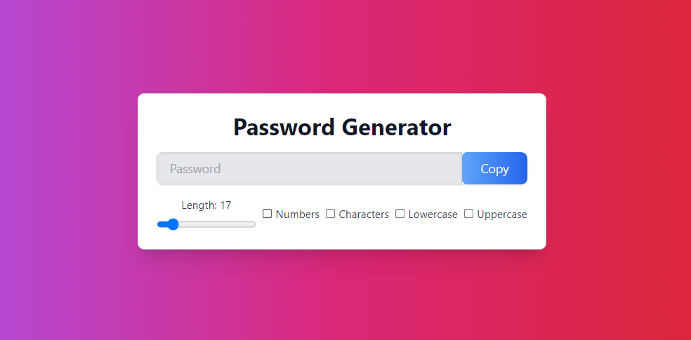

# React Password Generator App

This is a simple password generator web application built with React, Vite, and Tailwind CSS. It allows users to generate strong passwords with customizable options such as length, including numbers, characters, lowercase, and uppercase letters.



## Features

- Generate strong passwords with customizable options.
- Adjust password length using a range input.
- Include or exclude numbers, characters, lowercase, and uppercase letters.
- Copy generated passwords to the clipboard with a single click.
- Visual feedback for successful copy action.

## Technologies Used

- React: A JavaScript library for building user interfaces.
- Vite: A fast build tool that provides instant server start and optimized builds.
- Tailwind CSS: A utility-first CSS framework for rapidly building custom designs.

## Installation

To run the application locally, follow these steps:

1. **Clone the repository**:

   ```bash
   git clone https://github.com/inaveed-git/React-Password-Generator.git
   ```

2. **Navigate to the project directory**:

   ```bash
   cd react-password-generator
   ```

3. **Install dependencies**:

   ```bash
   npm install
   ```

4. **Start the development server**:

   ```bash
   npm run dev
   ```

5. **Open your browser** and go to `http://localhost:3000` to view the application.

## Usage

1. Adjust the length slider to choose the desired password length (between 6 and 100 characters).
2. Check or uncheck the checkboxes to include or exclude numbers, characters, lowercase, and uppercase letters in the generated password.
3. Click the "Copy" button to copy the generated password to the clipboard.
4. Visual feedback ("Copied!") will appear briefly to indicate a successful copy action.

---

Feel free to customize this README file further based on your specific project details and preferences!
